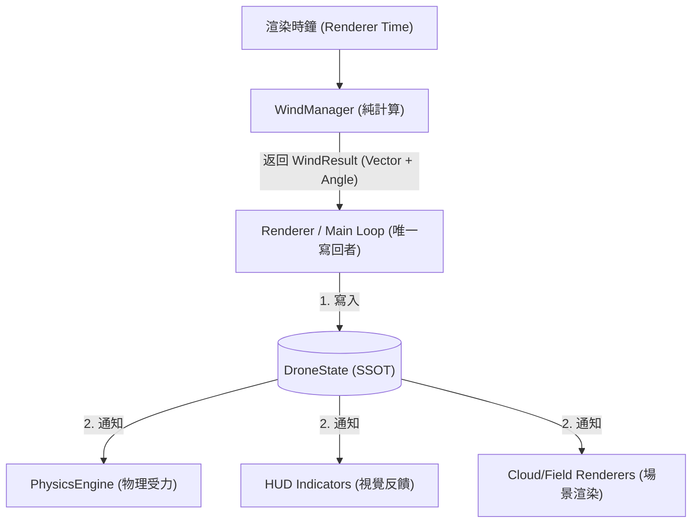

# Niko Drone Simulator - 環境系統架構規範 (Environment Arch)

## 1. 核心設計：單向環境數據流 (Unidirectional Environment Flow)

本系統確保大氣（風、擾流）、光照與視覺表現（雲、霧）在時間與邏輯上高度統一。

## 2. 數據寫回規範 (Write-back Policy)
1.  **無狀態計算**：環境計算組件（如 `WindManager`）嚴禁持有或修改 `DroneState` 中的屬性。
2.  **唯一寫回者**：僅限協調層（`Renderer`）具備對 `currentWindAngle` 與 `currentWindVector` 的寫入主權。
3.  **時間源**：統一使用 `rendererTime` 驅動，確保隨機風向在所有觀察者（物理 vs 視覺）中呈現一致的偏移。

## 3. 驗證標準
*   **單元測試**：通過 `EnvironmentalIntegrityTest.kt` 驗證計算函數的純粹性。
*   **視覺對位**：隨機風向下，風向指標箭頭應與雲層流動方向在視覺上完全對應。
