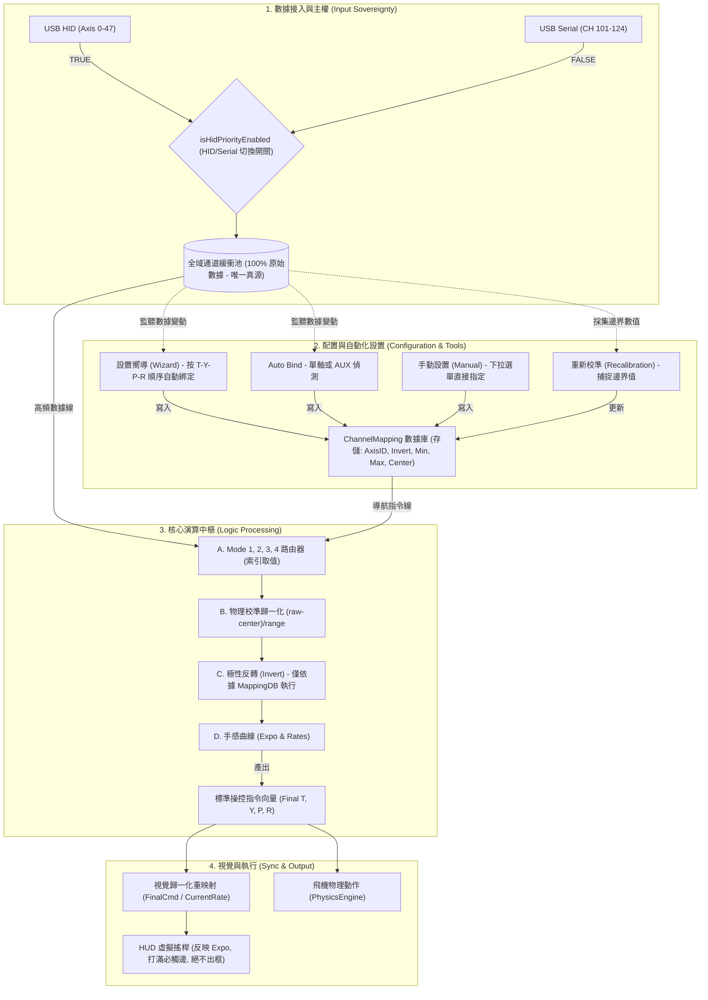

# Niko Drone Simulator - 輸入系統架構規範 (v1.7.9)

## 0. 核心設計哲學：數據與配置分離 (Separation of Concerns)
本系統遵循工業級飛控標準（參考 Betaflight/PX4），嚴格區分「原始數據流」與「邏輯解析清單」。

## 1. 邏輯線路圖 (Industrial Standard Architecture)



## 2. 數據流向規範
1.  **原始數據 (RawPool)**：進入緩衝池的數據必須是 100% 原始值。嚴禁在 `InputCoordinator` 或寫入 `RawPool` 前進行取反、偏移或任何數學加工。
2.  **單一反轉點 (Inverter)**：
    *   **實體路徑**：極性反轉依據 `MappingDB.inverted` 布林值執行。
    *   **虛擬路徑 (內置觸控)**：**嚴禁反轉**。虛擬搖桿始終遵循「右推為正」的物理直覺，無視 `inverted` 設定，以確保與物理引擎之視角對位絕對一致。
    *   **禁令**：嚴禁在代碼中進行未經規範定義的硬編碼取反。
3.  **視覺歸一化對位**：HUD 顯示必須執行 `VisualPos = FinalCmd / CurrentRate`。這確保了無論 Rate 設定為何，虛擬搖桿打到底時在視覺上也會剛好觸碰邊框。

## 3. 數據寫回與智慧仲裁 (Input Arbitration)
1.  **實體優先原則**：若實體搖桿軸位發生顯著變動（Delta > 0.01），則該軸主權由實體手把鎖定。
2.  **變動偵測接管**：當實體搖桿靜止時，虛擬觸控可立即接管主權。這解決了固定油門軸導致的 UI 失效問題。
3.  **單一歸一化路徑**：無論來源為何，進入物理引擎的指令必須保證「右/前為正」。

## 3. 驗證標準
*   **物理驗證**：必須通過 `PhysicsEngineTest.kt` 中的極性測試。
*   **視覺驗證**：Rate 設為 0.5 或 2.0 時，打滿桿虛擬搖桿均須觸碰邊緣且不出框。
```
